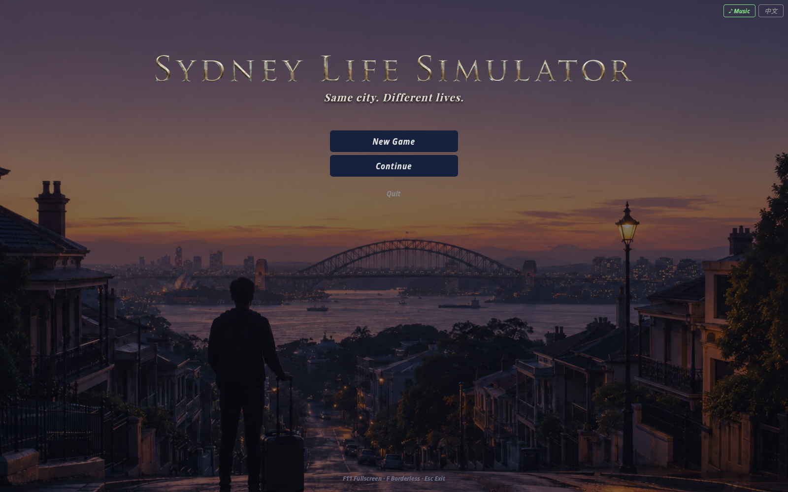
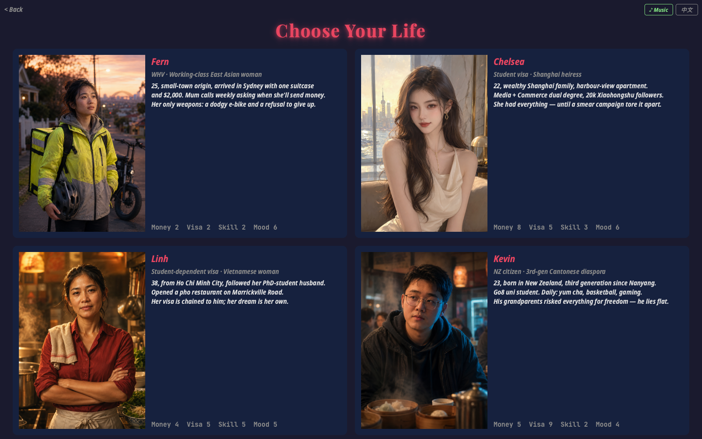

# Sydney Life Simulator · 悉尼人生模拟器

> **Same city. Different lives.**

A bilingual (English / 中文) branching-narrative game where you live one year in
Sydney through the eyes of four very different newcomers. Every choice shifts
four stats — **money, visa, skill, mood** — and steers the story toward one of
several endings, each with a verdict and a decision-tree of the path you took.



---

## The four lives



| | Character | Visa | In one line |
|---|---|---|---|
| 🛵 | **Fern (小敏)** | Working Holiday | A small-town battler delivering food on a dodgy e-bike. |
| 💎 | **Chelsea (思琪)** | Student | A Shanghai heiress whose perfect life is torn apart by a smear campaign. |
| 🍜 | **Linh** | Student-dependent | A Vietnamese mother building a pho restaurant — and her own way to stay. |
| 🀄 | **Kevin (阿杰)** | NZ citizen | A third-gen Cantonese-Kiwi drifting between a grey hustle and his uncle's kitchen. |

Four stories grounded in real Australian visa systems and migrant life. One
question underneath them all: *whoever you are, can you make your life mean
something through your own choices?*

---

## Features

- **Four 12-chapter storylines** (~48 decision points), each with multiple endings
- **Fully bilingual** — switch between pure English and pure Chinese any time
- **Decision-tree review** of every choice you made, plus an ending verdict
- **Adaptive soundtrack** — a theme per character, with mood cues that shift with the story
- **Original AI cover, portraits and scene art**
- **Graceful fallback** — runs even if images/audio are absent

---

## Run it

```bash
pip install -r requirements.txt      # PyQt6 + Pillow
python3 main.py
```

> Desktop GUI app (PyQt6) — run it locally, not in an online judge.
> `F11` fullscreen · `F` borderless · `Esc` exit fullscreen.

Run the logic tests (no GUI needed):

```bash
python3 -m unittest tests.test_engine -v
```

---

## Advanced concepts used (COMP9001)

1. **File I/O** — scene data loaded from JSON; save/load game progress
2. **Multi-Dimensional Lists** — the character stats table in `models.py`
3. **Testing** — 36 unit tests in `tests/test_engine.py`

---

*Author: Hanqing (Lucien) Xu · COMP9001 — Introduction to Programming*
